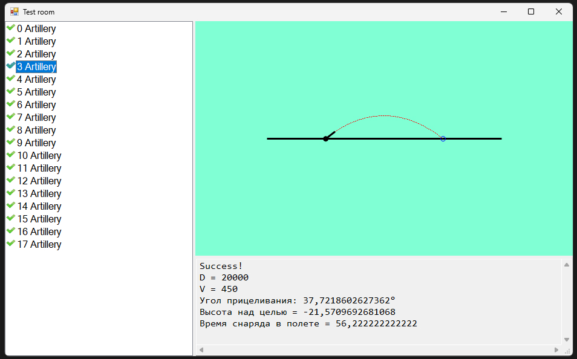

# Платформа: ulearn
## Курс: Основы программирования
### Тема: 1 Ошибки
#### Практика «Angry Birds»
##### Решено 12 сентября 2022 в 08:26

В файле AngryBirdsTask реализована функция расчета угла прицеливания, в зависимости от начальной скорости снаряда и дальности до цели. 

Если решения не существует, метод возвращает double.NaN.

Детали:
- Сопротивлением воздуха можно пренебречь
- Ускорение свободного падения g = 9.8 м/с2
- Иногда может существовать два решения: навесной траекторией и прямой наводкой. Нам нужно решение прямой наводкой, то есть с минимальным временем подлёта снаряда.
- Знания по физике в Википедии: статья про равноускоренное движение

